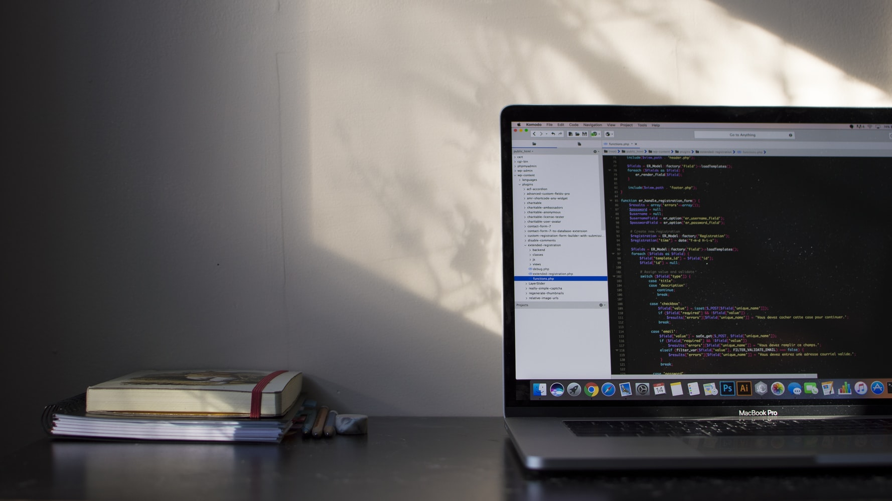

Hello folks 🙋‍. Today I want to share with you what I have learnt the last months of my life while I'm learning how to code.

If you are expecting to read the classic success story about someone making millions through an app made in a weekend this is not my case, I don’t even have a job in the tech industry right now.

However, I've seen **_improvements_** in others important areas of my life. Alright, let's start.

- Making a habit takes time (a good one): For the very first time in my life I put pressure on myself and I tried to code every day, it doesn’t matter if I had a bad day at work or anything unexpected happened, I left the drama, I turned my laptop on and did what I had to do. The result: I **_stopped procrastinating_**.

Why is this so important? I realized that there isn't a "fast track" for anything big in this life, we just have to take a look around to top people, athletes, entrepreneurs, artists, writers, all of them working hard every day of their lives. I really respect people that even knowing that they are talented, they try to improve themselves.

After you spend some months doing the same activity you will notice that it will become less and less tedious until you will get to the point that you need to do it. That’s the **_reward_**.

- Everything is hard before it’s easy: not in the tech world. Of course, along the way you will feel more comfortable while you get experience in specific technologies that you use in your daily routine, but definitely you are going to face new problems or requirements almost every day in your projects.

Maybe you are wondering:  How the heck can someone live with the stress of facing problems every day? Well, yes, in this industry sometimes it's kind of frustrating when you get stuck in something for hours, but it feels incredible when you deploy your first project to the internet.

Everything is a process, the soccer star trains hard the whole week to score a goal, the writer writes the whole year to publish a.best seller book, the politician makes campaigns for years to get a higher position.

And the most important, overcoming problems frequently helps me to become **_mentally strong._**

- Time is priceless. When you get engaged in an activity it's important to "flow" and **_focus_** in what you are doing.

There is a lot of noise out there, the news, the super bowl, the new show on Netflix. Although we need recreation because we are social human beings we have to pay attention where our time goes.

I'm learning how to optimize my time, I listen to my favorite music while I'm cooking, I read while I'm doing the laundry, I listen to my favorite podcast while I'm commuting to work.

And of course, I really enjoy when I go out with my friends or when I go for a walk to the park. It's just about being conscious about what do I do through my day.

As you can imagine learning to code is helping me to improve some areas in my life that were a disaster before and I’m very happy with that.

If you would like to give a try to this fantastic industry I strongly recommend to you start here [frecodecamp.org](https://freecodecamp.org)

Thanks for reading. Happy coding! 💫‍💻
